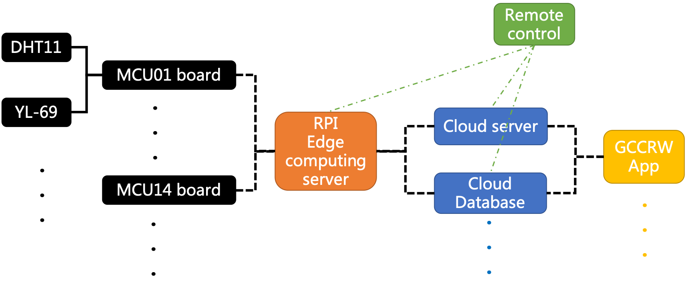

# GCCRW_env_setup
This repo provides some example codes for building IoT system environment for GCCRW model. 

Codes in "MCU_sensor_Arduino" is the examples of using MCU board with some elementary sensors. 

Codes in "RPI_Linux" is the examples of using RPI to tranfer and integrate data with other equipments. An example System architecture diagram is as below:

GCCRW model: https://github.com/qa4510qa/GCCRW_yhHuang.git

Algorithm logic please refer to <<從台灣傳統溫室建構智慧溫室物聯網系統：以溫室番茄的氣候風險為例，黃宇弘，2021>>